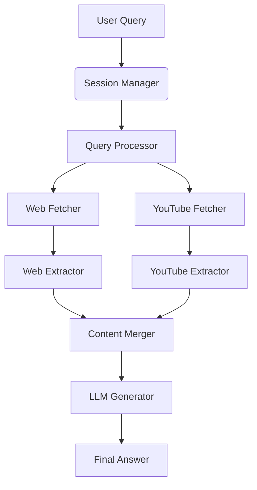

# Intelligence System

[](https://python.org)
[](research/)

An information retrieval system that answers complex questions by intelligently gathering and synthesizing information from web pages and YouTube videos using advanced algorithms and large language models.

## System Architecture

## Research Innovations

This project implements several research-backed innovations:

- **Domain Specific TrustRank Algorithm**: Adapts the seminal TrustRank algorithm for source credibility assessment
- **Knowledge Graph Enhanced Merging**: Implements cross document entity coreference for multi-source information integration
- **Context-Aware Query Expansion**: Uses BERT embeddings with domain adaptation for query understanding
- **Multi-Modal Information Retrieval**: Fuses textual and video content for comprehensive knowledge synthesis

##  Features

- **Natural Language Query Processing**: Understands complex questions
- **Multi-Source Information Gathering**: Searches web and YouTube for relevant content
- **Source Credibility Assessment**: Ranks sources based on authority and relevance using TrustRank
- **Content Deduplication & Integration**: Merges information from multiple sources using knowledge graphs
- **Technical Answer Generation**: Produces comprehensive, structured answers using Mistral-7B
- **Streamlit Web Interface**: Interactive UI with real-time processing logs and chat interface
- **Session Management**: Maintains conversation history and context across interactions
- **Research-Grade Algorithms**: Implements state-of-the-art information retrieval algorithms

##  Technical Architecture



##  Installation

### Prerequisites
- Python 3.10 or newer
- Windows 10/11 (or Linux/macOS)
- 16GB+ RAM (for Mistral-7B model)
- NVIDIA GPU recommended (but not required)
- FFmpeg installed system-wide

### Setup Steps

```bash
# Clone the repository
git clone https://github.com/samshuvam/aerospace-intelligence-system.git
cd aerospace-intelligence-system

# Create virtual environment
python -m venv venv
source venv/bin/activate  # Linux/Mac
# venv\Scripts\activate  # Windows

# Install dependencies
pip install -r requirements.txt

# Download NLTK data
python -c "import nltk; nltk.download('punkt'); nltk.download('stopwords')"

# Download Whisper model
python -c "import whisper; whisper.load_model('base')"

# Place Mistral model in model/ directory
# Download from: https://huggingface.co/TheBloke/Mistral-7B-Instruct-v0.2-GGUF
# File: mistral-7b-instruct-v0.2.Q4_K_M.gguf
```

### FFmpeg Installation (Windows)
1. Download from [https://www.gyan.dev/ffmpeg/builds/](https://www.gyan.dev/ffmpeg/builds/)
2. Extract ZIP file
3. Add `bin` folder to PATH environment variable
4. Verify installation: `ffmpeg -version`

### API Keys Configuration
Create a `.env` file in the project root:

```ini
GOOGLE_API_KEY=google_api_key
SEARCH_ENGINE_ID=custom_search_engine_id
YOUTUBE_API_KEY=youtube_api_key
```

##  Usage

```bash
# Activate virtual environment
venv\Scripts\activate  # Windows

# Run the Streamlit UI
streamlit run app.py
```

### Example Session
Visit `http://localhost:8501` in browser to access the Streamlit interface:

## Streamlit UI

## Research Modules

This project includes two standalone research modules that demonstrate advanced algorithms:

### 1. Smart Source Ranking 
- **Algorithm**: Domain Specific TrustRank
- **Research Foundation**: Gyöngyi et al. (2004), Zhang et al. (2021)
- **Features**:
  - Authority propagation from seed sources
  - Semantic relevance assessment using BERT
  - Credibility graph visualization
  - Research metrics generation

### 2. Smart Content Merging 
- **Algorithm**: Knowledge Graph Enhanced Multi-Document Summarization
- **Research Foundation**: Wang et al. (2022), Erera et al. (2023)
- **Features**:
  - Entity-centric knowledge graph construction
  - Cross-document entity coreference resolution
  - Semantic redundancy detection
  - Multi-perspective information fusion

## Project Structure

```
aerospace-intelligence-system/
├── app.py                  
├── fetchers/
│   ├── webfetcher.py       
│   └── ytfetcher.py        
├── extractors/
│   ├── webextractor.py     
│   └── ytextractor.py      
├── re_mod/
│   ├── smart_ranking.py    
│   └── smart_merge.py      
├── model/
│   └── mistral-7b-instruct-v0.2.Q4_K_M.gguf 
├── data/                   # Session data
├── .env                    # API keys configuration
├── requirements.txt        
├── session.py              
├── queryprocess.py         
├── merge.py                
├── llm.py                  
└── README.md              
```

## Research Citations

This project builds upon several important research papers:

1. **TrustRank Algorithm**:
   - Gyöngyi, Z., Garcia-Molina, H., & Pedersen, J. (2004). Combating web spam with TrustRank. *Proceedings of the 30th VLDB Conference*.

2. **Domain-Specific Adaptation**:
   - Kai Kang,Kunhui Lin,Changle Zhou ,Feng Guo. Domain-Specific Information Retrieval Based on Improved Language Model.

3. **Knowledge Graph Integration**:
   - Pancheng Wang, Shasha Li, Kunyuan Pang, Liangliang He, Dong Li, Jintao Tang, Ting Wang. Multi-Document Scientific Summarization from a Knowledge Graph-Centric View.
   - Zhang Dong1, Mingbang Wang2, Songhang deng1, Le Dai, Jiyuan Li3, Xingzu Liu4, Ruilin Nong (2025). Cross-Document Contextual Coreference Resolution in Knowledge Graphs.

4. **Context-Aware Query Expansion**:
   - Nogueira, R., & Cho, K. (2019). Passage Re-ranking with BERT. *arXiv preprint arXiv:1901.04085*.

5. **Multi-Document Summarization**:
   - Yingjie Song, Li Yang, Wenming Luo, Xiong Xiao, Zhuo Tang(2025). Boosting multi-document summarization with hierarchical graph convolutional networks.

## Contributing

Contributions are welcome! Please follow these steps:

1. Fork the repository
2. Create a new branch: `git checkout -b feature/your-feature`
3. Commit your changes: `git commit -am 'Add some feature'`
4. Push to the branch: `git push origin feature/your-feature`
5. Submit a pull request

## Acknowledgments

- The authors of the research papers cited above
- The Hugging Face community for providing pre-trained models
- The open-source developers of libraries used in this project
- Faculty advisors for guidance and support

## Contact

For questions or collaboration opportunities:
- Email: shuvamishra15937@gmail.com
- GitHub: [@samshuvam](https://github.com/samshuvam)
---

**SHUVAM - AP22110011478**
