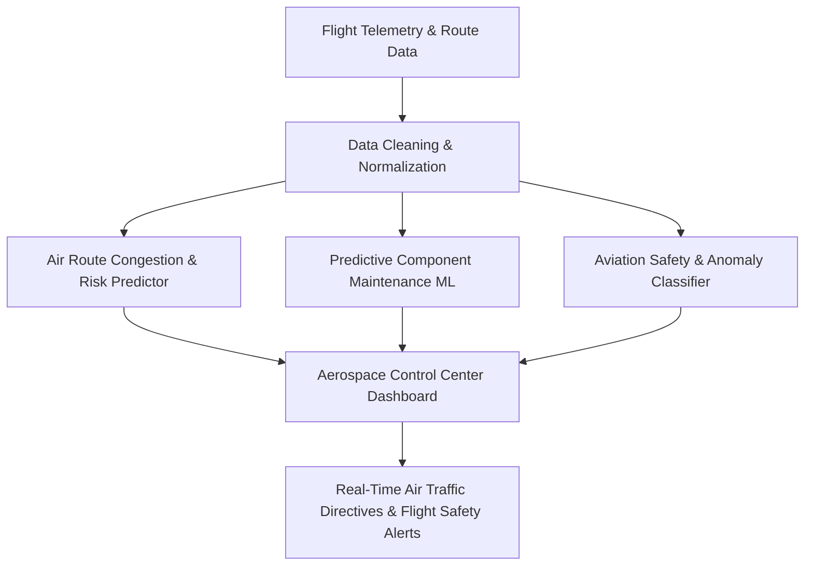

# AI-Driven Air Traffic Management & Aerospace Intelligence System

[](https://www.python.org/)
[](#)
[](#)
[](LICENSE)

> **OFFICIALLY ACCEPTED AT ICAAsT 2024**  
> **Paper Title**: *AI Driven Air Traffic Management and Aerospace Risk Intelligence*  
> **Conference**: **International Conference on Advances in Aerospace Technologies (ICAAsT 2024)**

An end-to-end Machine Learning and Decision Intelligence suite designed for airspace conflict detection, predictive flight maintenance, pilot safety assessment, and optimized air route navigation.

---

## ✈️ Core System Modules

1. **Air Route Conflict & Risk Prediction Engine** (`air_rout_data.csv`, `NEW CODES/`): Analyzes flight trajectories, spatial congestion, and atmospheric variables to recommend conflict-free airways.
2. **Predictive Aircraft Maintenance ML** (`train_maintenance_model.py`): Flight Data Monitoring (FDM) analytics predicting component degradation prior to flight dispatch.
3. **Flight Operations Risk Assessment** (`train_operations_model.py`): Multi-factor accident and operational anomaly detection models trained on historical aviation safety records.
4. **Synthetic Pilot Safety & Rating Classifier** (`pilot_rating_model`): Evaluates pilot performance telemetry to compute risk metrics under adverse flight conditions.

---

## 🏗️ System Workflow


```mermaid
graph TD
    FlightData[Flight Telemetry & Route Data] --> Preprocess[Data Cleaning & Normalization]
    Preprocess --> RouteModel[Air Route Congestion & Risk Predictor]
    Preprocess --> MaintModel[Predictive Component Maintenance ML]
    Preprocess --> OpsModel[Aviation Safety & Anomaly Classifier]
    
    RouteModel --> Synthesis[Aerospace Control Center Dashboard]
    MaintModel --> Synthesis
    OpsModel --> Synthesis
    
    Synthesis --> Output[Real-Time Air Traffic Directives & Flight Safety Alerts]
```

---

## 🚀 Quick Start

```bash
# Clone repository
git clone https://github.com/samshuvam/aerospace-intelligence-system.git
cd aerospace-intelligence-system

# Install dependencies
pip install pandas numpy scikit-learn matplotlib seaborn

# Run flight operations risk evaluation
python train_operations_model.py
```

---

## 👤 Author & Contact

**Shuvam Singh**  
- Email: [shuvamsingh1122@gmail.com](mailto:shuvamsingh1122@gmail.com)  
- GitHub: [@samshuvam](https://github.com/samshuvam)  
